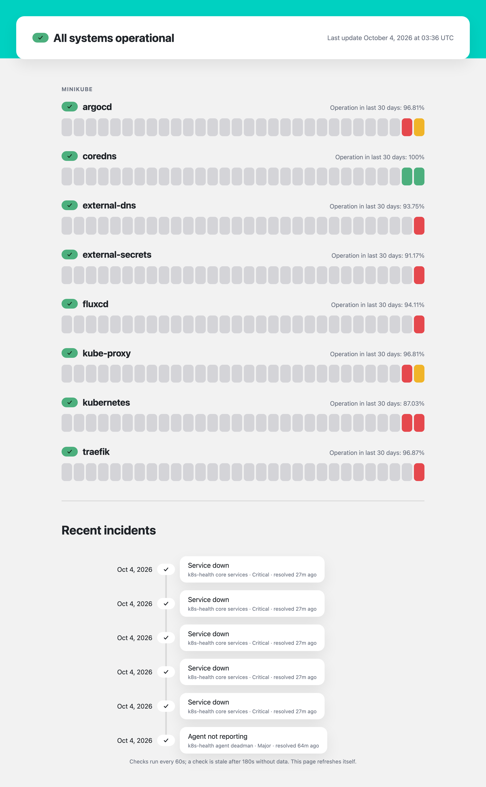

# k8s-health

[](https://github.com/jthiatt/k8s-health/actions/workflows/ci.yaml) [](LICENSE)

Health checks for any Kubernetes cluster's core services, reported to **Splunk Observability Cloud**, with alerts, a dashboard and an optional status page.

- **Agent** (`agent/`): runs in each cluster. Every minute it checks the API server, cluster DNS, node readiness and the add-ons it finds (CoreDNS, Cilium, Argo CD, Flux and more). It sends one up/down gauge per check, `k8s.health.up`, through the Splunk OTel Collector you already run, plus selected Prometheus series from those add-ons.
- **Alerts and dashboard** (`splunk/`, Terraform): a **dead man's switch** that tells you when a cluster's agent goes silent, rules for services that are down, and a cluster-health dashboard.
- **Status page** (`status-page/`, optional): one page for all clusters, showing each service's current state, 30 days of daily uptime and recent incidents. It reads the Splunk API, so it can run anywhere.

<p align="center">
  <picture>
    <source media="(prefers-color-scheme: dark)" srcset="docs/images/status-page-dark.png">
    
  </picture>
  <br><em>The status page on a test cluster. The red days are deliberate outage tests.</em>
</p>

```
 each cluster                                                 Splunk Observability Cloud       anywhere
┌───────────────────────────┐ OTLP  ┌───────────────────────┐ ┌──────────────────────────┐ API ┌──────────────┐
│ k8s-health agent (x3,     │ :4318 │ Splunk OTel Collector │ │ k8s.health.up            │────▶│ status page  │
│ one leader)               │──────▶│ agent (same node)     │▶│ detectors ─▶ incidents   │────▶│ (optional)   │
│  API server, DNS, nodes,  │       └───────────────────────┘ │ dashboard                │     └──────────────┘
│  add-ons, /metrics        │                                 └──────────────────────────┘
└───────────────────────────┘
```

---

## Requirements

1. **A Kubernetes cluster.** Any conformant distribution (EKS, GKE, AKS, kind, minikube, k3s, bare metal), with `kubectl` and **Helm 3.14+** to install.
2. **A Splunk Observability Cloud account**, and its realm (shown under Settings → Organization, for example `us1` or `eu0`).
3. **The Splunk OTel Collector installed on the cluster**, sending metrics to that account. This is the [`splunk-otel-collector` Helm chart](https://github.com/signalfx/splunk-otel-collector-chart). With its defaults, its per-node agent accepts OTLP on port 4318 of each node, which is where the k8s-health agent sends. If you run a gateway instead, point the agent at it with `agent.otlpEndpoint`.
4. **Splunk access tokens** (Settings → Access Tokens):

   | Token | Scope | Used by |
   |---|---|---|
   | Ingest | **INGEST** | The Splunk OTel Collector, which you already set up for requirement 3. The k8s-health agent needs **no token** of its own. |
   | API, read | **API** | The status page, to read metrics and incidents. |
   | API, admin | An API token that can create detectors and dashboards (for example a user API token) | Terraform, once, to create the alerts and dashboard. |

---

## Quick start

### 1. Check the collector

From any pod, using one of your nodes' IPs (`kubectl get nodes -o wide`):

```bash
kubectl run otlp-probe --rm -it --restart=Never --image=curlimages/curl -- \
  curl -s -o /dev/null -w '%{http_code}\n' -X POST -H 'Content-Type: application/json' \
  -d '{"resourceMetrics":[]}' http://<node-ip>:4318/v1/metrics
```

`200` means the collector is ready. Anything else: see [Troubleshooting](#troubleshooting).

### 2. Install the agent in each cluster

```bash
helm install k8s-health oci://ghcr.io/jthiatt/charts/k8s-health \
  --namespace k8s-health --create-namespace \
  --set clusterName=<unique-name-for-this-cluster>
```

To install from a checkout instead, use `charts/k8s-health` in place of the `oci://` reference.

That's all that's required. The agent checks the API server, DNS and nodes, plus every add-on profile whose workloads it finds in this cluster (see [What gets checked](#what-gets-checked)). Then:

```bash
kubectl -n k8s-health get lease k8s-health-agent                     # HOLDER = the leader
kubectl -n k8s-health logs "$(kubectl -n k8s-health get lease k8s-health-agent -o jsonpath='{.spec.holderIdentity}')"
```

The leader's first lines list the services it reports, and which add-ons it skipped as not installed. Within a minute or two, `k8s.health.up` with your `cluster` appears in Splunk's Metric Finder.

### 3. Add the status page (optional, once)

One status page shows every cluster, so enable it in one install only:

```bash
kubectl -n k8s-health create secret generic k8s-health-splunk-api --from-literal=token=<API read token>
helm upgrade k8s-health oci://ghcr.io/jthiatt/charts/k8s-health -n k8s-health --reset-then-reuse-values \
  --set statusPage.enabled=true \
  --set statusPage.splunk.realm=<realm> \
  --set statusPage.splunk.existingSecret=k8s-health-splunk-api
kubectl -n k8s-health port-forward svc/k8s-health-status-page 8080:80   # http://localhost:8080
```

**The page has no login.** To expose it, enable `statusPage.ingress` behind your SSO (for example oauth2-proxy), or keep it internal.

To run it outside Kubernetes:

```bash
docker run -p 8080:8080 -e SPLUNK_REALM=<realm> -e SPLUNK_API_TOKEN=<API read token> ghcr.io/jthiatt/k8s-health-status-page
```

### 4. Create the alerts and dashboard

Run this once per Splunk org, from a checkout, with Terraform:

```bash
cd splunk
cp terraform.tfvars.example terraform.tfvars   # set splunk_realm and deadman_notifications
export TF_VAR_splunk_token=<API admin token>
terraform init && terraform apply
```

This creates:
- **Detector `k8s-health agent deadman`:** alerts the `deadman_notifications` recipients when any cluster's agent sends nothing for 5 minutes. See [Alerts](#alerts).
- **Detector `k8s-health core services`:** a service down for 2 minutes, plus add-on-specific rules. These rules only raise incidents until you add notifications.
- **Dashboard group `k8s-health`**, with dashboard **Cluster health**. Its URL is printed as `dashboard_url`.

Terraform keeps its state in `splunk/terraform.tfstate`, which is git-ignored. For a team, add a remote backend to `splunk/main.tf`.

---

## What gets checked

Every check reports `k8s.health.up` = 1 (pass) or 0 (fail), with the dimensions `cluster`, `service` and `check`. A service's status is its worst check.

**Core, as service `kubernetes`, on every cluster:**

| Check | Passes when |
|---|---|
| `apiserver/readyz` | The API server's `/readyz` returns 200 |
| `dns/kubernetes.default.svc.<clusterDomain>.` | Cluster DNS resolves from the agent pod. This exercises DNS end to end, whatever runs it. |
| `nodes/ready` | At most `maxNotReady` (default 0) nodes aren't Ready. Nodes younger than 5 minutes are ignored, so autoscaling doesn't flap the check. |

**Add-on profiles.** By default (`enabled: auto`) each one is reported **only if at least one of its workloads exists** in the cluster, so the same values work everywhere:

| Profile | Workloads | Metrics scraped (`metrics`) | Fails when (besides workloads not ready) | Tested on |
|---|---|---|---|---|
| coredns | `kube-system/coredns` | :9153, on by default | any CoreDNS panic | minikube |
| kube-dns | `kube-system/kube-dns` (GKE) | none | none | not yet |
| kube-proxy | `kube-system/kube-proxy` DaemonSet | none | none | minikube |
| cilium | `cilium` DaemonSet, `cilium-operator` | :9962 and :9963, **off by default** | an eBPF map over 90% full | minikube (Cilium 1.20, metrics on) |
| fluxcd | 4 controllers in `flux-system` | :8080, on | a reconcile running over 15 minutes | minikube (Flux v2.9) |
| argocd | server, repo-server, redis, application-controller | :8082 and :8084, on | work queue over 100 | minikube |
| traefik | `traefik/traefik` | :9100, on | pod can't be scraped | minikube (chart 41.6, Traefik v3.7) |
| external-secrets | controller, webhook, cert-controller | :8080, on | any ClusterSecretStore not Ready | minikube (chart 2.11) |
| external-dns | `external-dns/external-dns` | :7979, on | no successful sync in 10 minutes | minikube (chart 1.23) |
| karpenter | `kube-system/karpenter` | :8080, on | pod can't be scraped | not yet |

"Not yet" means the profile follows the component's upstream Helm chart defaults (names, namespaces, labels, ports), but nobody has run it against a live install. Check it against your cluster, and please send a PR with fixes or a "tested on" entry.

Some forwarded series only exist in some setups or once the component is in use. `cilium_operator_ipam_ips` is only exported in Cilium's cloud IPAM modes (AWS ENI, Azure, multi-pool), `traefik_entrypoint_requests_total` appears after Traefik serves its first request, and `externalsecret_sync_calls_total` once an ExternalSecret exists. Until then their dashboard charts stay empty; that's expected.

**Upgrading:** use `helm upgrade --reset-then-reuse-values` (Helm 3.14+), as in the quick start. Plain `--reuse-values` also keeps the *previous* chart's defaults, so improved profiles in a new version would be silently ignored.

Turn Cilium's metrics on (`agent.profiles.cilium.metrics=true`) only after enabling them in Cilium itself (`prometheus.enabled` and `operator.prometheus.enabled`). Otherwise the scrape fails, and Cilium shows as down.

## Configuration

Everything is in [`charts/k8s-health/values.yaml`](charts/k8s-health/values.yaml), which is commented throughout. The settings you're most likely to change:

| Value | Default | Purpose |
|---|---|---|
| `clusterName` | required | The `cluster` dimension. Must be unique per cluster. |
| `intervalSeconds` | `60` | How often checks run. The status page marks a check stale after 3 intervals, so keep it the same across clusters. |
| `agent.replicas` | `3` | One leader runs the checks; the rest stand by ([High availability](#high-availability)). |
| `agent.otlpEndpoint` | node IP, port 4318 | Set it if your collector runs as a gateway, e.g. `http://splunk-otel-collector.<ns>.svc:4318`. |
| `agent.core.*` | all on | API server, DNS (`clusterDomain`, `extraDnsNames`) and node checks. |
| `agent.profiles.<name>.enabled` | `auto` | `auto` (report only if installed), `true` (always; missing = down), or `false`. |
| `agent.profiles.<name>.metrics` | per profile | Also scrape the component's `/metrics`. |
| `agent.profiles.<name>.checks` | per profile | Override when your install uses other names or namespaces. |
| `agent.extraServices` | `{}` | Your own services, using the check syntax below. |
| `agent.antiAffinity` | `soft` | `hard` refuses to put two replicas on one node, so it needs at least `agent.replicas` nodes; extra replicas stay Pending. |
| `statusPage.*` | disabled | `enabled`, `splunk.realm`, `splunk.existingSecret` (or `splunk.apiToken`), `title`, `ingress`, `detectorMatch`. |

**Use `enabled: true`, not `auto`, for components you must be alerted about.** In auto mode, if every workload of a component disappears, the agent assumes it was uninstalled and stops reporting it rather than reporting it down.

### Check reference

A service is a list of checks. Add your own with `agent.extraServices`:

```yaml
agent:
  extraServices:
    payments-gateway:
      enabled: true          # or auto
      checks:
        # Workload readiness: every desired replica is ready. kind: deployment | statefulset | daemonset
        - {kind: deployment, namespace: payments, name: gateway}
        # DNS lookup. A trailing dot skips search-domain expansion, so failures come back fast.
        - {dns: gateway.payments.svc.cluster.local.}
        # Scrape Prometheus metrics: every running pod matching the selector, by IP (or {url: http://host:port/metrics}).
        - metrics: {namespace: payments, selector: app=gateway, port: 9090}
          forward: [http_requests_total]               # also send these series to Splunk
          max: {gateway_queue_depth: 500}              # fail above
          min: {gateway_workers: 1}                    # fail below (or if missing)
          max_age: {gateway_last_success_timestamp_seconds: 600}  # fail if older (or missing)
```

How metrics checks behave:
- **Which pods:** every **running** pod matching the selector is scraped. The check fails if none match or one can't be reached.
- **Selectors:** `forward`, `max`, `min` and `max_age` keys can be a metric name or `name{label="value",...}`, which matches only series with those labels.
- **Missing series:** `min` and `max_age` fail when nothing matches, because they assert something is present. `max` passes when nothing matches.
- **Forwarded series:**
  - **Name and dimensions:** each keeps its name, with dimensions `cluster`, `service`, `pod` and its own labels.
  - **Counter or gauge:** series the endpoint declares as counters (by its `# TYPE` lines, including histogram buckets, sums and counts) are sent as cumulative counters; everything else as gauges.
  - **NaN and Inf:** dropped.
- **Watch the number of series:** forwarded series multiply by pods and label values, so only forward what you chart or alert on.

Two more check types, used by the core service: `{apiserver: /readyz}` and `{nodes: {max_not_ready: 0, ignore_younger_than_seconds: 300}}`.

---

## Alerts

### Dead man's switch: `k8s-health agent deadman`

If an agent dies, its node's collector can't send, or the collector can't reach Splunk, the metrics just stop. Every other alert then goes quiet, because there's nothing to evaluate. This detector turns that silence into an alert.

| Rule | Severity | Fires when | Notifies |
|---|---|---|---|
| Agent not reporting | Major | A cluster that was reporting has sent no `k8s.health.up` for 5 minutes | `deadman_notifications` (required) |

- **Grouped per cluster:** each silent cluster gets its own alert, naming the cluster.
- **The message** says what to check first: the agent pods, the Lease holder and its logs, then the collector on the leader's node. It links to [Troubleshooting](#troubleshooting).
- **Recovery:** it resolves by itself, with a notification, when data returns.
- **5 minutes** means 5 missed intervals, so a leader failover (at most 30 seconds) doesn't trip it.
- **Retiring a cluster:** its alert stays open until the cluster's series expire in Splunk. Mute or close it when you delete a cluster on purpose.
- **`deadman_notifications`** takes Splunk notification strings: `Email,<address>`, `Team,<teamId>`, `PagerDuty,<integrationId>`, `Slack,<integrationId>,<channel>`.

### `k8s-health core services`

These rules have no recipients by default, so they only raise incidents, which the status page shows. Add `notifications` to the rules you want to be paged on.

| Rule | Severity | Fires when |
|---|---|---|
| Service down | Critical | Any check of a service has been 0 for 2 minutes |
| Cilium nodes unreachable | Critical | Cilium reports unreachable nodes for 5 minutes |
| Traefik 5xx rate high | Major | More than 5% of an entrypoint's requests are 5xx for 5 minutes |
| ExternalDNS registry errors | Major | Registry errors every minute for 10 minutes |
| Flux reconcile errors | Warning | A Flux controller has errors every minute for 10 minutes |
| Argo CD app degraded | Warning | An app has been `Degraded` for 10 minutes |
| ExternalSecret not syncing | Warning | An ExternalSecret has been not Ready for 15 minutes |
| Karpenter nodepool near limit | Warning | A nodepool has been above 90% of a limit for 10 minutes |

Rules for add-ons you don't run never fire.

## Status page

| Part | Shows |
|---|---|
| Header | **All systems operational**, **N services down**, **Some checks are not reporting** (stale), or **operational with N active alerts** |
| Each cluster, each service | Current state: up, down (the failing checks are listed), or stale (no data for 3 intervals). Also one block per UTC day for 30 days (green ≥ 99.9%, amber ≥ 99%, red < 99%, grey = no data), and "Operation in last N days". |
| Recent incidents | Incidents from detectors whose name contains `detectorMatch` (`k8s-health`): ongoing ones first, then those resolved in the last 7 days, each linking to its detector |

**How uptime is calculated:**
- **Source:** daily figures are worked out from Splunk's hourly averages of the 0/1 gauge.
- **Worst check wins:** a service's day is its worst check's figure for that day.
- **Rounded down:** 99.995% shows as 99.99%.
- **Silence isn't downtime:** hours with no data don't count against uptime.

**Freshness:** the page caches Splunk for 30 seconds (history for 10 minutes), so it can lag Splunk by up to 30 seconds.

The JSON behind the page is at `/api/status`.

## High availability

The agent runs **3 replicas** by default. They elect a leader through a Kubernetes **Lease** (named `<release>-agent`), the same mechanism client-go's leader election uses. Only the leader runs checks.

- **Leader's node dies, or loses the API server:** it stops acting 20 seconds after its last renewal, and a standby takes over once the 30-second Lease has expired. Standbys retry every 10 seconds, so that's at most about 40 seconds. Updates to the Lease are compare-and-swap, so two leaders never overlap.
- **Leader can't reach its node's collector:** after 3 failed sends in a row it steps down for 60 seconds, so a replica on another node takes over.
- **Rollouts:** on shutdown the leader releases the Lease, so a standby takes over within seconds.
- **Probes:** `/readyz` passes while the API server answers. `/healthz` fails if the election loop stops or a check cycle hangs, which restarts the pod.
- **Placement:** preferred one replica per node (`agent.antiAffinity`), spread across zones, and a PodDisruptionBudget (`maxUnavailable: 1`).
- **Rollouts** replace one pod at a time without adding an extra one (`maxSurge: 0`), so upgrades also work with `antiAffinity: hard` on a cluster that has exactly as many nodes as replicas.

**Tested on minikube:**
- **Graceful handover:** 1 to 2 seconds.
- **Frozen leader:** replaced in 23 to 33 seconds, then restarted by its liveness probe after 65 to 75 seconds.
- **Data:** no gap in Splunk beyond one normal interval.

## Troubleshooting

Find the leader first, since it's the only replica that logs check results:

```bash
L=$(kubectl -n k8s-health get lease k8s-health-agent -o jsonpath='{.spec.holderIdentity}'); kubectl -n k8s-health logs "$L"
```

| Symptom | Likely cause |
|---|---|
| Deadman alert, or a whole cluster **stale** | The agent pods aren't running, or the leader logs `ingest failed` (it can't reach the collector; run the probe from [step 1](#1-check-the-collector)). Also check the collector pod on the leader's node, and the collector's own logs (token, network). |
| A cluster never appears | Check `clusterName`, the leader's logs, and that the collector exports metrics at all (do other collector metrics reach Splunk?). |
| An add-on isn't listed | It's in `auto` mode and none of its workloads were found; the leader logs `not installed, skipping`. Your install may use other names or namespaces: override `agent.profiles.<name>.checks`. |
| `metrics/...` fails with `no running pods match selector` | The label selector doesn't match your install: compare with `kubectl get pods -n <ns> --show-labels`. |
| `metrics/...` fails with a timeout or connection refused | Wrong port, metrics disabled in the component, a NetworkPolicy blocking the agent's namespace, or (host-network pods such as Cilium) node firewall rules. |
| `... missing` in a check error | A `min` or `max_age` series doesn't exist in your version of the component. |
| `nodes/ready` fails | Nodes are NotReady: `kubectl get nodes`. Raise `agent.core.nodes.maxNotReady` if a few are expected. |
| `Forbidden` in agent logs | RBAC wasn't applied (or was changed): `helm upgrade` again. |
| Status page: `Splunk API error: HTTP Error 401` | The API token is wrong, expired, or lacks API scope. |
| Status page shows no incidents | Detector names don't contain `statusPage.detectorMatch`. If you changed Terraform's `name_prefix`, change `detectorMatch` to match. |
| A removed check still shows | Expected for up to about 15 minutes; then the page drops it, as long as the rest of the cluster keeps reporting. |

---

## Development

See [CONTRIBUTING.md](CONTRIBUTING.md) for running tests, a local minikube setup, adding a profile and releasing.

## License

[Apache License 2.0](LICENSE).
